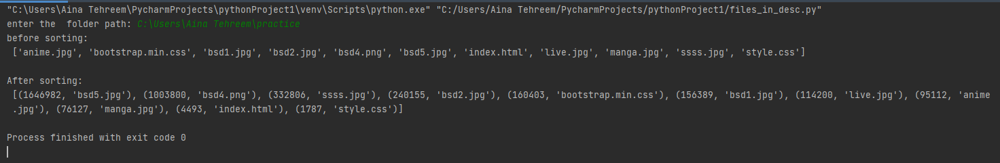
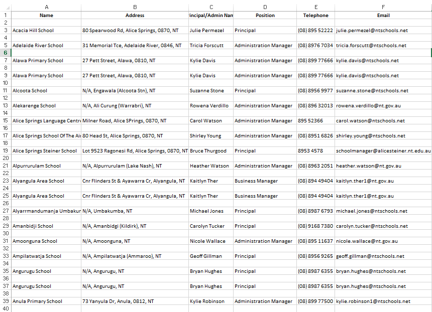

# DSC-DSU | Python Bootcamp 2020 | Week 2

 ## Take as user input a folder path and print all the files in descending order of their respective sizes

    import os

    pair=[]
    directory=input("enter the  folder path: ")
    directory=directory+'/'    
    files=os.listdir(directory)
    print("before sorting:\n",files)

    for i in files:
        location=os.path.join(directory,i)
        size=os.path.getsize(location)
        pair.append((size,i))

    print()
The sort() method accepts a reverse parameter as an optional argument.
Setting reverse = True sorts the list in the descending order.    

    pair.sort(reverse=True)
    print("After sorting:\n",pair)
## output:

## 3. Build a school scraper that'll scrap 50 schools' info and generate a CSV.

        import requests
    from bs4 import BeautifulSoup
    import csv
    import json
    from selenium import  webdriver

We will get this magic api by going to --> inspect > Network > disable cache and hide data urls > refresh page >GetAllSchools >Request URL
    
    page_url= 'https://directory.ntschools.net/api/System/GetAllSchools'
    r=requests.get(page_url)
    htmlcontent=r.text
    soup=BeautifulSoup(htmlcontent,'html.parser')
    #print(soup.prettify())
    parsed_data= json.loads(htmlcontent)
    
Here we create the csv in which we will store the data:

    with open('school.csv', "w") as f:
        thewriter= csv.writer(f)
        thewriter.writerow(['Name', 'Address','Principal/Admin Name', 'Position', 'Telephone', 'Email'])
        count=0
        for i in parsed_data:
            count=count+1
            #print(i['itSchoolCode'])
            school_data_link=("https://directory.ntschools.net/api/System/GetSchool?itSchoolCode="+i['itSchoolCode'])
            r=requests.get(school_data_link)
            a=json.loads(r.content)
            name = (a['name'])
            address = (a['physicalAddress']['displayAddress'])
            
It is possible that in some cases there is no admin in the school and only a principal so we will use TRY/EXCEPT to check whether an error will arrise at [1] and if it does arrise, we will check the [0]

            try:
                principal_name = (a['schoolManagement'][1]['firstName'] + " " + a['schoolManagement'][1]['lastName'])
                position = (a['schoolManagement'][1]['position'])
                phone = (a['schoolManagement'][1]['phone'])
                email = (a['schoolManagement'][1]['email'])
            except:
                principal_name = (a['schoolManagement'][0]['firstName'] + " " + a['schoolManagement'][0]['lastName'])
                position = (a['schoolManagement'][0]['position'])
                phone = (a['schoolManagement'][0]['phone'])
                email = (a['schoolManagement'][0]['email'])

            thewriter.writerow([name, address, principal_name, position, phone, email])
            if count==50:
                break
 ## output
 
 
and it will go on till 50 schools. The CSV file is attached.               
